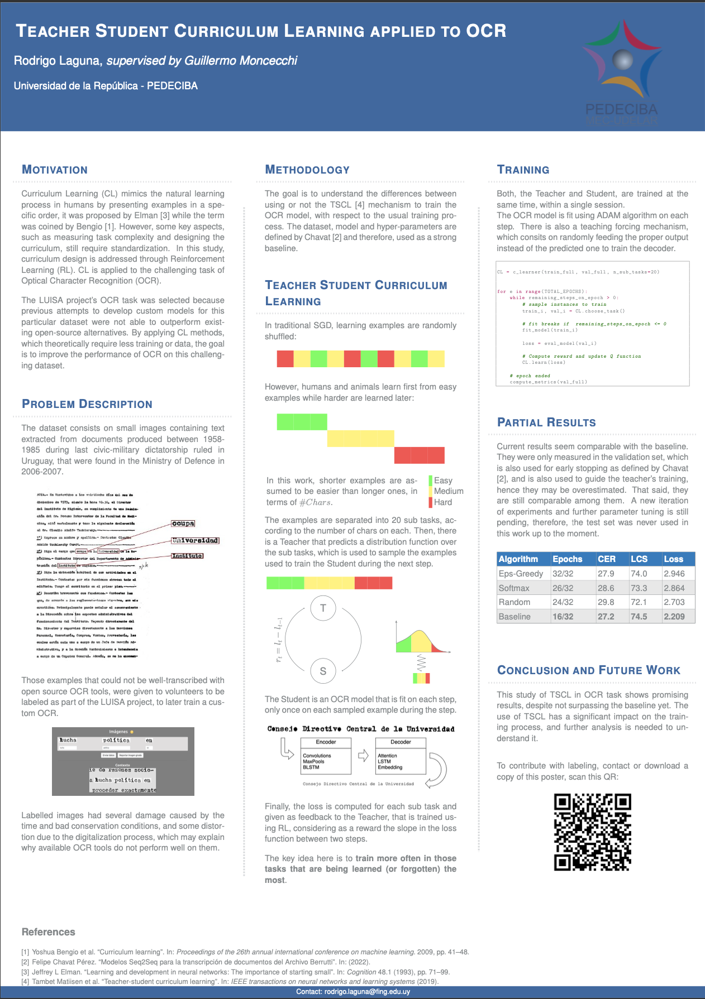

# Teacher Student Curriculum Learning applied to OCR

If you arrive here, you probably come from [khipu](https://khipu.ai/)!

## The poster

&nbsp;&nbsp;&nbsp;&nbsp;&nbsp;&nbsp;&nbsp;&nbsp;   
  
You can download it [here](Khipu_poster_rlaguna_v4.pdf).

## Contact
Let's keep in touch! 
 - [rodrigo.laguna@fing.edu.uy](mailto:rodrigo.laguna@fing.edu.uy)
 - [@ro_laguna_](https://twitter.com/ro_laguna_) in Twitter
 - [rodrigo-laguna](https://www.linkedin.com/in/rodrigo-laguna/) in Linkedin

## Contribute to Luisa

You can contribute to the labeling process [here](https://mh.udelar.edu.uy/luisa/).

## References
- [[1] Yoshua Bengio et al. “Curriculum learning”. In: Proceedings of the 26th annual international conference on machine learning. 2009, pp. 41–48](https://qmro.qmul.ac.uk/xmlui/bitstream/handle/123456789/15972/Bengio%2C%202009%20Curriculum%20Learning.pdf). 
- [[2] Felipe Chavat Pérez. “Modelos Seq2Seq para la transcripción de documentos del Archivo Berrutti”. In: (2022)](https://www.colibri.udelar.edu.uy/jspui/bitstream/20.500.12008/33944/1/CHA22.pdf).
- [[3] Jeffrey L Elman. “Learning and development in neural networks: The importance of starting small”. In: Cognition 48.1 (1993), pp. 71–99](https://langev.com/pdf/elman93cognition.pdf).
- [[4] Tambet Matiisen et al. “Teacher-student curriculum learning”. In: IEEE transactions on neural networks and learning systems (2019)](https://arxiv.org/abs/1707.00183).

The experiments presented in this poster were carried out using [ClusterUY](https://cluster.uy).

